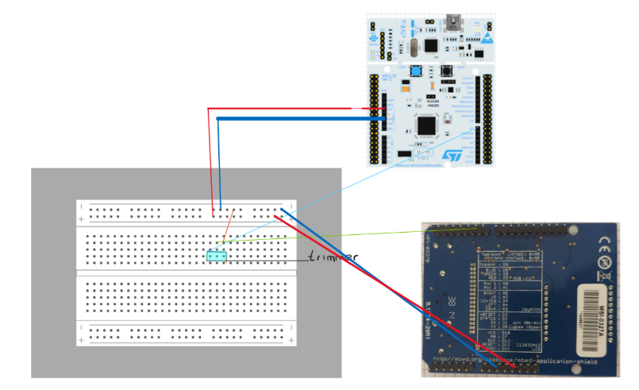
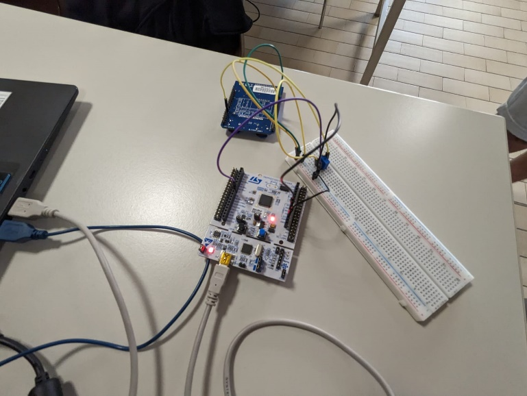
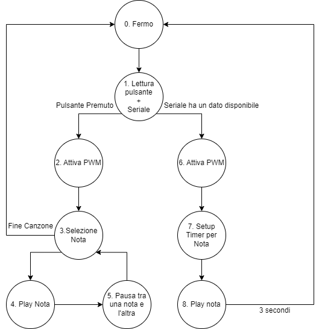

# mpbi-buzzer

This project consists of the realisation of a microcontroller that allows us to make a buzzer play sounds, in more detail the realisation consists of two fundamental parts:

1. Implement a short song of our choice
2. Receive a note of your choice via serial communication and play it for a set duration

We assumed a working range of the buzzer between 500 and 10000 Hz, in order to fully utilise the
frequency response characteristic of the device.

## 1. Electrical diagram

The schematic consists of two devices, the
STM32F401 microcontroller and MBED
application shield used for sound
reproduction. The microcontroller is
powered via USB, it supplies the 3.3V power
supply to the breadboard and the shield via
the blue and red connections. There is a
trimmer in the circuit to adjust the volume of
the buzzer.

## 2. State machine

Regarding the choices applied in the implementation of the microcontroller, we decided to use a
state machine consisting of eight states.

From the initial condition of all stopped and off, it switches to state one of waiting for user input.
The input can be of two types: pressing the button on the board or receiving data from the UART
interface. In the first case, the programme switches to state two by activating the PWM and
entering a cycle in which a song is played, at the end of which the system returns to the stopped
state and waits again for an input.

In the second case, the programme plays the note specified by the user via the serial. The note is
played for an arbitrarily set time of three seconds. Once the playback of the note is finished, the
system returns to wait for new input. The input to be sent via the serial must be a number
between 500 and 10000, representing the frequency range we have assumed.

## 3. Design choices and code

We decided to implement the programme using a state machine, which is why there is a switch
case in the while loop which allows you to switch from one state to another. As mentioned earlier
there are two modes implemented one in which a pre-set song is played and another in which a
data is sent from the serial and the specified frequency is played. We have chosen to start the
song only when the on-board button on the board is pressed, while frequency playback on the
serial takes place as soon as a datum is available and the device is not in another mode. The preset
song is stored in the form of an array called melody, consisting of a series of values in succession;
there is a sequence of notes to be played and a divider time (a parameter that determines how
long a note is played for). E.g.: melody[] = {note, time, ......}

At each cycle the programme reads the inputs, serial and button, and decides the next state to
switch to. If the button is pressed, the song is played following the steps below:

- Selection of the note: first it is checked that the song has not ended, if the song has ended
    it returns to the zero state. Otherwise, the note to be played and the time for which it is to
    be played are selected, extracting the values from the array named melody. The current
    note is identified by the variable idNote. The prescaler, noteDuration and maxCount
    parameters are then calculated. The prescaler is calculated to obtain the desired frequency
    output to the PWM, the following formula is used:
       𝐹𝑐𝑘𝑘
𝑃𝑆𝐶 = 𝐹𝑝𝑤𝑚 ∙ (𝐴𝑅𝑅 + 1 ) -^1
    NoteDuration is calculated based on the duration of a whole note and represents the
    duration in seconds that the note is played. Finally, the maxCount is calculated in order to
    obtain a note duration equal to noteDuration, using the function calculateCount. The
    dutyCycle of the PWM is then set to 50%, so that the note can be played back.
- Replay Note: The countCycles is incremented each time the timer reaches its maximum
    count until the maxCount is reached. When this condition occurs the countCycles is reset
    to be used for the pause time and the dutyCycle is set of the timer to 0%, so that no sound is played, and finally it switches to the pause state
    between notes.

- Pause time between one note and the next: as in the previous state, countCycles is
    incremented until maxCount is reached. When the condition is reached, idNote is
    incremented so that the new note to be played is selected. You then return to the note
    selection state.

In the event that the button is not pressed, the UART is read. The contents of the buffer are
checked by means of a for loop and it is checked whether the characters '\n\r' are present, in
which case the input data is converted into an integer. This data represents the frequency to be
played back. We have decided to play the notes coming from the serial for three seconds. Then
the following operations are performed:

- Calculation of presclaer, noteDuration and maxCount: these three parameters are required
    for note reproduction.
- Note: As in the previous case, the countCycles is incremented until the maxCount is
    reached. Once the condition has been verified, it returns to the zero state and finally to the
    reading of the new input.

## 4. Results

As a result, a short song can be played when the button on the microcontroller is pressed, and a
note can be sent to the controller via the serial port to be played, for a chosen time of three
seconds.

Tests of the programme's functionality can be viewed via the attached videos.

<video src="doc/final_result.mp4" controls title="Title"></video>

The first video shows the performance of the short song following the pressing of the button on
the microcontroller. The song chosen is "Never gonna give you up" by Rick Astley.

In the second video, the serial communication is shown, in particular how sending the frequency
value through the RealTerm programme of a certain note is played by the buzzer for a duration of
3 seconds, in particular the frequencies used for the video were: 1319 and 2349 Hz.

